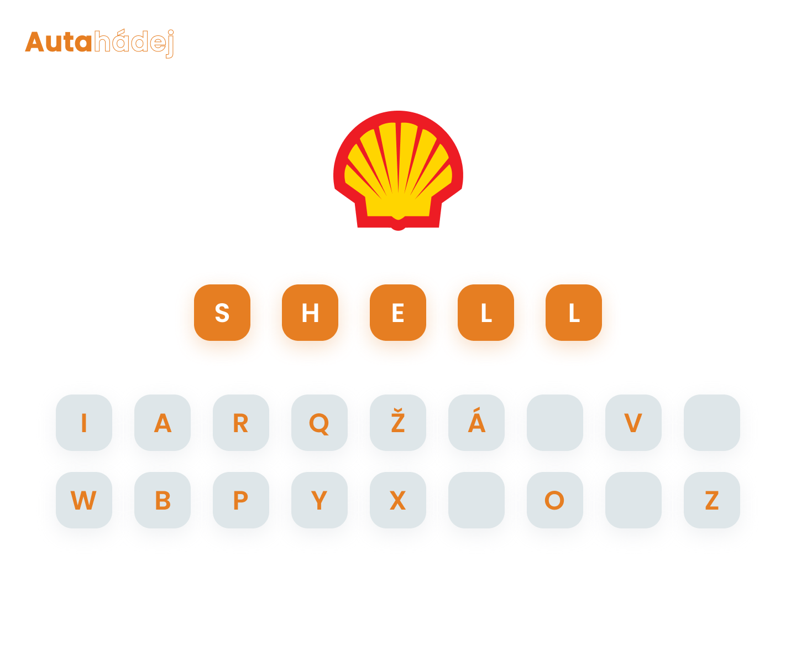

# Logo puzzle quiz
Quiz, ve kterém se hádají loga. Jsou rozdělena do kategorí. Po uhodnutí loga se odkryje část obrázku. Obrázek je vždy na stejný motiv jako je kategorie - když je kategorie auta, odkrývá se obrázek auta.

## Účel hry
Hlavním účelem hry je uhodnout co nejvíce log různých firem a značek.

## Kategorie
* auta 
* sport 
* jídlo
* oblečení 

## Struktura
Hra bude je strukturována do třech hlavních stránek:
### Přehled katogorí
Když hráč navštíví hru, jako první se setká právě s touto stránkou.
Zde se nachází přehled všech kategorií log, které hráč může hádat. Po výběru kategorie se hrář dostává na herní desku.
### Herní deska 
Na tuto stránku se hráč dostane po té, co vybere kategorii, kterou chce hádat. V horní části se zobrazuje logo, které má hráč uhodnout. Uprostřed je nabídka písmen, které je možné použít k hádání. Mezi nimi se skrývá i název té firmy, která se hádá.
### Obrázek, který se odkrývá
Po úspěšném uhodnutí je hráč přesunut na obrazovku, kde se mu postupně odkrývá obrázek. Při každém uhodnutí levelu je odrykta jedna část obrázku. Když je obrázek celý odkrytý, načte se nový, celý zakrytý obrázek.

## Vzhled
### Nástěnka

### Výběr loga k uhodnutí

Výběr log - oblečení

Výběr log - auta

Výběr log - jídlo

### Hádání log

Výběr loga - oblečení

Výběr loga - auta

### Odhalující se obrázek

Odhalující se obrázek - oblečení

Odhalující se obrázek - auta

### Odhalený obrázek

Odhalený obrázek - oblečení

Odhalený obrázek - auta
